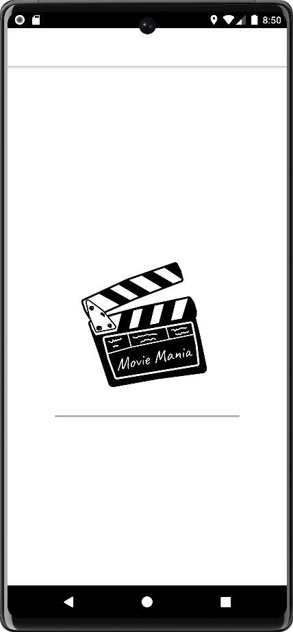
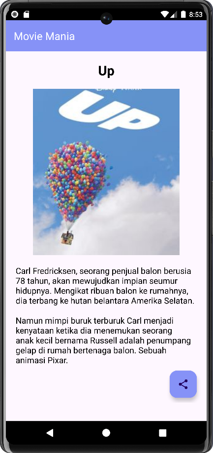

# MovieManiaApp
Moviemania is an app that shows a several lists of films along with their genres which can be seen on the Home page. For the development of this application, I utilize using Kotlin language.
## Features
- **Efficient Movie Listing** : MovieMania uses RecyclerView to list movies efficiently and not wasting memory, providing a smooth scrolling experience
- **Clean and Simple Design** : Each movie is contained within a CardView displaying the name and genre of each movie provided, giving the user convenience.
- **Detailed View and Share** : Users can click one of the movie to view more details about it and share it, making it easy to know & explore about the movie.
## Screenshots

  
  
  

